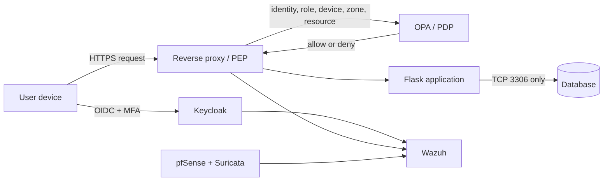

# Zero Trust Architecture Home Lab

I built this NIST SP 800-207-aligned Zero Trust home lab using pfSense network segmentation, Keycloak identity and MFA, device-aware authorization, Open Policy Agent (OPA) policy-as-code, Wazuh centralized monitoring, Suricata network detection, and Kali Linux validation testing. The architecture is designed around explicit per-resource access, least privilege, default-deny segmentation, and centralized security telemetry instead of implicit trust based on LAN location.

## Architecture

The lab separates user, server, IoT, management, and optional security-monitoring zones. pfSense controls network reachability, Keycloak establishes user identity and MFA state, and OPA evaluates resource-specific authorization. A reverse proxy or application middleware enforces OPA decisions. Wazuh and Suricata provide centralized host, authentication, firewall, application, and network visibility.

## Technology stack

| Layer | Technology | Purpose |
|---|---|---|
| Virtualization | Oracle VirtualBox | Isolated lab virtual machines and adapters |
| Network enforcement | pfSense | Routing, segmentation, stateful firewall policy, logging |
| Identity | Keycloak | OIDC, roles, MFA, authentication events |
| Policy | Open Policy Agent | Context-aware authorization decisions as code |
| Application enforcement | Reverse proxy / middleware | Enforces decisions for protected HTTP requests |
| Monitoring | Wazuh | Centralized log analysis and alerting |
| Network detection | Suricata | Scan, flow, and IDS/IPS visibility |
| Validation | Kali Linux | Authorized testing against personally owned lab systems |

## Network zones

| Zone | Example subnet | Trust posture |
|---|---|---|
| User | `10.0.10.0/24` | Authenticated, not broadly trusted |
| Server | `10.0.20.0/24` | Protected workloads |
| IoT | `10.0.30.0/24` | Low trust and constrained |
| Management | `10.0.40.0/24` | High sensitivity |
| Security (optional) | `10.0.50.0/24` | Restricted monitoring services |

## Access policy summary

- Users may reach the protected reverse proxy over HTTPS, but not the database or management plane directly.
- The application host may reach the database only on the required service port.
- IoT systems may use only explicitly required Internet, DNS, and NTP services and cannot initiate access to protected internal zones.
- Management interfaces are restricted to approved administrative endpoints.
- Sensitive application access requires the expected role, MFA, trusted-device context, source zone, and resource-specific policy decision.

## Validation plan

| Test | Objective | Expected result |
|---|---|---|
| VT-01 | Verify MFA-protected authentication | Password-only access is insufficient |
| VT-04 | Use valid credentials from an untrusted device | Sensitive access is denied |
| VT-06 | Connect directly from the user zone to TCP/3306 | Direct database access is blocked |
| VT-09 | Review centralized authentication telemetry | Relevant events are visible in Wazuh |

Evidence images are intentionally not fabricated. Add only sanitized screenshots captured during authorized tests to `evidence/` using the documented filenames.

## Standards alignment

This project is conceptually aligned with NIST SP 800-207 and mapped to the CISA Zero Trust Maturity Model v2.0. It is not described as NIST-certified, CISA-certified, or independently compliant.

## Limitations and future improvements

The current lab uses simplified device identity rather than continuous MDM/EDR posture, runs on a single virtualization host, and has lab-scale identity, governance, response automation, and availability. High-value next steps include mutual TLS, richer endpoint posture, short-lived SSH certificates, centralized secrets management, automated OPA tests in CI, infrastructure as code, and quantitative performance testing.

## Repository contents

- `docs/` - the full technical report
- `diagrams/` - architecture and flow diagrams
- `policy/` - OPA authorization policy and tests
- `firewall/` - network plan and sanitized rule intent
- `identity/` - sanitized Keycloak notes
- `monitoring/` - Wazuh and Suricata notes
- `evidence/` - sanitized validation evidence only
- `scripts/` - controlled validation commands

## Responsible use

All security testing described here is limited to systems I own and am authorized to test. Do not run validation commands against third-party systems without explicit permission.

## References

- [NIST SP 800-207: Zero Trust Architecture](https://doi.org/10.6028/NIST.SP.800-207)
- [NIST SP 1800-35: Implementing a Zero Trust Architecture](https://doi.org/10.6028/NIST.SP.1800-35)
- [CISA Zero Trust Maturity Model v2.0](https://www.cisa.gov/resources-tools/resources/zero-trust-maturity-model)

